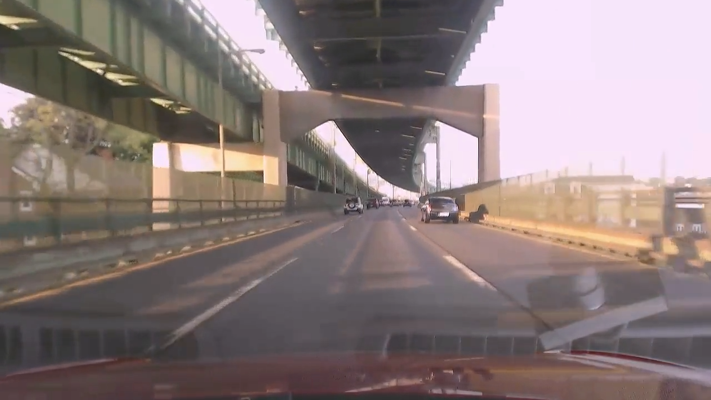
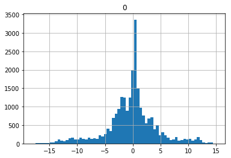
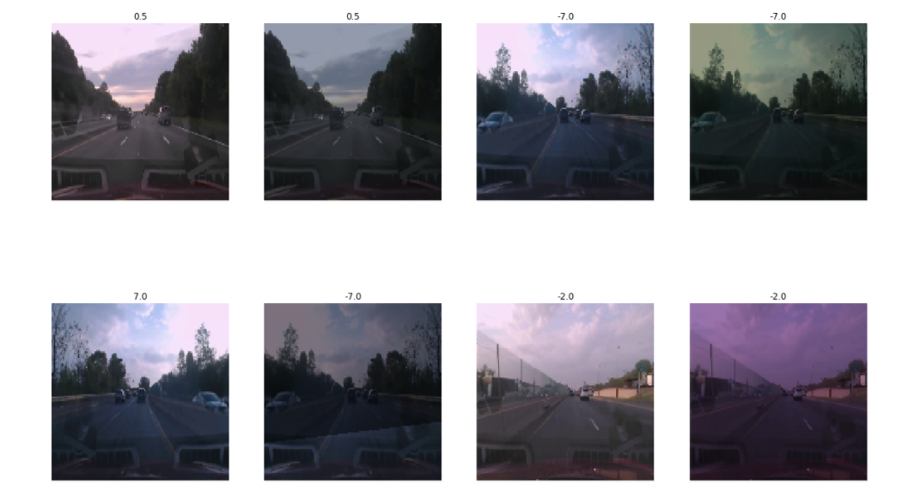
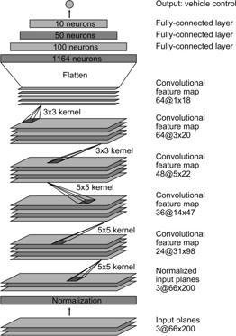
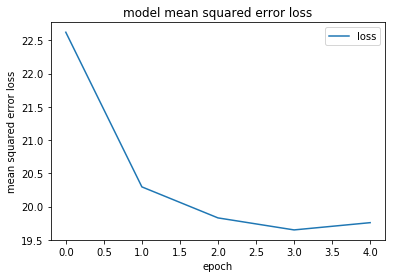
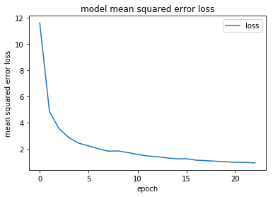
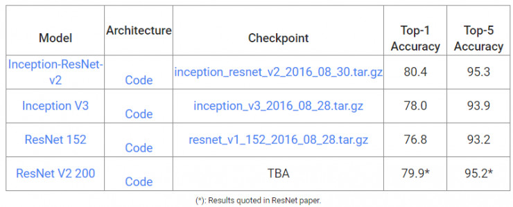
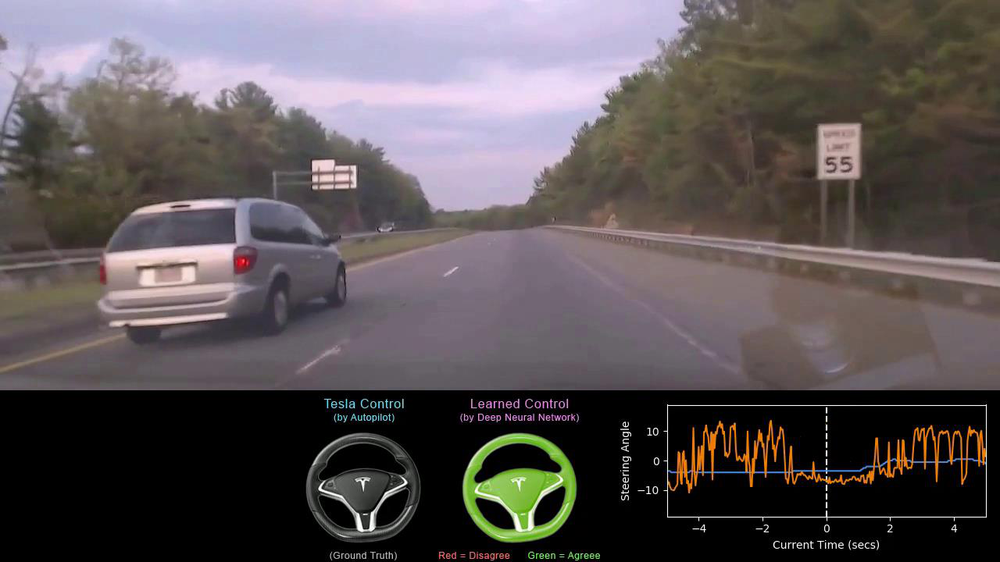

# I.问题的定义
## 项目概述
计算机视觉是机器到人类世界的一个接口，它让机器会“看”，甚至“认知”。其中无人驾驶技术正渐渐改变人们的出行方式。在汽车问世不久之后，发明家们就开始研究自动驾驶汽车了。
1925年，发明家Francis Houdina展示了一辆无线电控制的汽车，他的车在没有人控制方向盘的情况下在曼哈顿的街道上行驶。
1995年，Pomerleau和他的同事Todd Jochem在公路上试驾了他们的无人驾驶汽车。他们的无人驾驶小型货车（他们必须控制速度和刹车）穿越了2797英里，
2002年，DARPA宣布了一项重大挑战，他们为顶级研究机构的研究人员设立的条件是：如果他们能建造一辆能够在莫哈维沙漠行驶142英里的无人驾驶汽车，他们将提供100万美元的奖金。
当2004年挑战开始时，15个竞争者中没有一个能够完成任务。Sebastian Thrun(也是GoogleX和Udacity的创始人)在2005年带领Stanford的队伍第一次完成了该挑战赛
现在通用汽车、福特、奔驰、宝马等大型汽车公司都在研发自己公司的自动驾驶汽车技术。奥迪更是在17年推出了首辆L3级别的量产车！
MIT 6.S094: Deep Learning for Self-Driving Cars教程Deeptesla项目就描述来如何利用车载摄像头提供的路况图像，去判断车辆的转向角度。如何搭建较好的模型就是我们今天的课题。

## 问题描述
课程的原始数据是以mkv的视频格式提供的，需先将视频转化为图片。共有9段视频作训练数据，约24300帧图片。测试集一段视频，约2700帧图片。且其中有不少数据还处于转向角度为0附近，即车辆近似直行状态。所以需要对数据集做扩充处理。并且筛选出训练收益比较大的数据。卷积神经网络，可以较好地满足平移不变性，但训练时间较长，如何有效的缩短训练时间，且提高准确率也是值得考量的。
计划利用Keras深度学习框架搭建端到端的模型，训练模型到给它一张图片能够输出近似人为判断的转向角度。卷积神经网路（Convolutional Neural Network, CNN）是一种前馈神经网路，它的人工神经元可以响应一部分覆盖范围内的周围单元，对于大型图像处理有出色表现。

## 评估指标

我们可以用模型预测的值与实际的label的误差来评估，由于是单一的数据，且有正负值，计划使用均方差来作为模型好坏依据。具体公式为:((y_pred-y_true)**2).mean().


# II. 分析
## 数据的探索

数据集共10组，每组有1段短视频及CSV格式保存的转向数据。转向角度-18到15不等。

ts_micro | frame | wheel 
---|---|---
1464650070285910.00 |	0|	-1
1464650070319240.00 |	1|	-1
1464650070352580.00 |	2|	-1

视频50秒到2分10秒不等，大部分为高速公路路况，光线好，视线清晰。少部分桥梁，高架下，等光线较暗等路况。


## 探索性可视化
除去用作验证集的第10段视频，可用作训练集约24300帧图片，label分布的直方图如下：



可以看到大部分数据集中在-3到3这一个区间，大角度的数据占比就很少了。

24300帧数据。数据显然是不够的。需要采取变更色彩，亮度，随机阴影等方法增加训练数据。为了模型具有更好的预测转弯角度，可以适当增加转向角度绝对值大于1的图片，提高转弯数据的比重。
## 算法和技术
由于本机机器性能有限，需要用到gennerator 批量的生成数据，以减少资源占用过多导致程序无法运行的情况。使用opencv,nmpuy对图片进行增加随机阴影，更改亮度，反转图片处理，扩充数据集。下图为生成器代码：

```
def generator(data_path,label_path,batch_size=64):

    data = np.load(data_path)
    label = np.load(label_path)
    while 1:
        
        data,label = shuffle(data,label)
        images = []
        steers = []
        for orimg,steer in zip(data,label):

            images.append(orimg)
            steers.append(steer)
            #增加降低亮度的图
            
            images.append(Lower_brightness(orimg)) 
            steers.append(steer)

            if fabs(steer)> 1:
                
                #增加翻转图片
                img_flip = cv2.flip(orimg,1)
                images.append(img_flip)
                steers.append(steer*-1)

                #增加带随机阴影的图
                images.append(add_shadow(orimg))
                steers.append(steer)
            if len(images)>= batch_size :         
                X = np.array(images)   
                Y = np.array(steers)
                images = []
                steers = []
                yield (X,Y)
```

使用keras迁移学习，利用imagenet数据集训练好的Top前5的模型，提取图片的特征，再开放一定的层数可用作训练，加强本项目应用场景的适用度。

## 基准模型
本次将采用NVIDIA end-to-end Model 作为基准模型。
网络的第一层执行图像标准化，接着卷积层提取特征，最后是全连接层用提取的特征进行训练并最终输出转向角度。模型的结构如下图：



很不幸这个模型的表现并不好，本来使用没有数据增强的数据集 Loss还能在第一个Epoch降到20以下。但只能拟合这小部分的数据泛化能力必然不够，随后使用编好的生成器训练Loss就一直没有得到优化。


# III. 方法
## 数据预处理
先将分散的数据集压缩到140*140的长宽，并打包成1个npy对象，方便以后调用。
生成器中将每张图变化一次颜色，转向角度绝对值大于1的图片，增加反转图与随机阴影图。

基准训练前做归一化处理。使用Keras预训练模型时，InceptionResNetV2自带预处理查源码，一样是使用x/127-1做归一化。

## 执行过程
导入Keras，以及我们需要的各种类型的层，优化器。
以序列或者函数形式搭建网络。
利用model.fit_generator函数批量训练网络 同时创建callback类记录每个批次训练后的loss。
训练完成后储存模型以及这次训练的loss历史记录


## 完善
起初基准模型的loss一直降不到20以下，调整了几次优化器，最后选择了adam ，学习速率0.0001，才有效地降低了loss。
generator从单纯的取固定数量的图片改为有条件的输出。加深了对yield的理解，随机的增加效果也是为了以后有更好的泛化能力
在InceptionResNetV2基础上创建的优化模型，起初没有开放过多的层，只在全局平均池化后的全连接层做训练，一次epoch后大约能降到14左右的loss。后来开放靠后的一些卷积层，可以一次epoch可以降到12以下了。期间测试过开放所有层，第一个epoch loss就能到5以下！不过训练要求的时间太多，而且后面到1.5左右也开始收敛，综合考虑只开放最后的十几层。训练20轮后降loss降到了1以下！

# IV. 结果
## 模型的评价与验证
在要求loss在1以下的标准下，收敛速度，训练时间基本与预期相符，训练途中大约在epoch7次的时候，改过数据增强部分的参数，比如由降低色彩时乘的系数，阴影的深度，只有不到0.2loss的浮动。


Inception-ResNet-v2是早期Inception V3模型变化而来，从微软的残差网络（ResNet）论文中得到了一些灵感。残差连接（Residual connections ）允许模型中存在shortcuts，可以让研究学者成功地训练更深的神经网络（能够获得更好的表现），这样也能明显地简化Inception块。下方图表所示，Inception-ResNet-v2架构的精确度比之前的最优模型更高，图表中所示为基于单个图像的ILSVRC 2012图像分类标准得出的排行第一与排行第五的有效精确度。此外，该新模型仅仅要求两倍于Inception v3的容量与计算能力。
此次Inception-ResNet-v2的表现不负所望，loss非常有效的在递减。

## 合理性分析
优化模型相对基准模型除了训练时间差很多，其他各项指标都遥遥领先。
可以对比图2基准模型loss和图 3 优化模型loss，基准模型在有的优化器下甚至都无法完成梯度下降的任务。而优化模型表现就好很多。
不过，数据集还是太小了，且场景不一，曾经调用过callback，看每一批次的loss信息，loss浮动很大。可能与数据增强做的不合理有关。而且这次的评估标准很单一，就是输出的角度是否与视频中匹配（这还要有视频中都是合理驾驶的前提在）。放到现实中来，虽然司机方向盘打的多，但很快又会回到原始轨道，也是合理的。
从搭建更好的模型来看，最终结果还是令人满意的。


# V. 项目结论
## 结果可视化
使用前辈编好的run.py生成验证集角度是否匹配的视频。右下角的框体中，蓝色为标准线，黄色为模型根据图像预测的转向角度。右边的方向盘呈绿色即模型预测的在允许的误差范围内，若偏差太多则呈红色。可能由于增加了反转图片，补充了转向角度大的图片，模型预测结果波动很大。看来分类模型做回归题还是差了点。。。


## 对项目的思考
迁移学习把已学训练好的模型参数迁移到新的模型来帮助新模型训练。考虑到大部分数据或任务是存在相关性的，所以通过迁移学习我们可以将已经学到的模型参数（也可理解为模型学到的知识）通过某种方式来分享给新模型从而加快并优化模型的学习效率不用像大多数网络那样从零学习。
经过整合数据，数据集的探索，写生成器，训练模型，最后在验证集上看效果。以loss为标准，对比基准模型。最后的模型符合预期。
不过通用场景下不适用，本次用到的训练集大多都在公路上，且车况良好，现实中可不那么简单！训练适用通用场景的模型，需求的数据集的大小和本次项目差的可不止5个数量级。
遇到困难的就是用run.py的时候需要去装好相应的环境 ffmpeg ,openh264。。。好在程序在win10下都能正常的跑起来。
项目期间，不断的有想实现的小模块，然后去理解相应的代码，或者直接调用框架内的函数，一步一步解决问题。最后跑通全部的代码，甚是欣慰，努力没白费。这就是所谓的打小怪升级吧。希望后续碰到更复杂的项目，也能顺利完成。

## 需要作出的改进

模型调参：
最后一层可能使用tanh激活函数会好一些。
可以开放更多的层。
可以使用adam优化器

更好的数据集：
可以使用opencv识别出车道线，并画出，再剪接部分不重要的天空部分。
可以降数据增强部分 绝对值大于1，改为3或5 这样模型可能预测的波动不会这么大。

训练时增加验证集loss。


### 引用：
>Keras文档  https://keras.io/   

>Google最新开源Inception-ResNet-v2，借助残差网络进一步提升图像分类水准 
https://www.leiphone.com/news/201609/303vE8MIwFC7E3DB.html

>无人驾驶技术初探——让特斯拉（Tesla）学习人类的驾驶技术 
https://zhuanlan.zhihu.com/p/25334400
